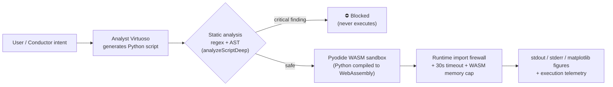

# Project Valhalla — Safe Execution of AI-Generated Code

> **The one-line version:** Aura lets an LLM agent *write Python and run it* — and Project Valhalla is the security layer that makes that safe. Scripts are statically analyzed, then executed inside an in-browser **WebAssembly sandbox** with a runtime import firewall, capability isolation, and CPU/memory budgets. No server, no container, no host access.

Letting a language model generate code is easy. **Executing that code without handing an attacker (or a hallucination) the keys to the machine is the hard part** — and it's the problem most "AI writes code" demos quietly skip. Valhalla doesn't skip it.

---

## Why this is hard (and worth a look)

An autonomous agent that emits executable scripts is a remote-code-execution engine pointed at your own runtime. To make it safe you need to answer, concretely:

- How do you stop a generated script from reading the filesystem, opening a socket, or shelling out?
- How do you catch the *obfuscated* escape (`getattr(x, '__class__')`, `globals()['os']`, `__builtins__`) that a naïve keyword filter misses?
- How do you stop an infinite loop or a memory bomb from freezing the tab?
- And how do you do all of this **client-side**, with no backend to attack?

Valhalla's answer is **defense in depth** — five independent layers, each of which would have to fail for an escape to succeed.

---

## How it works



1. **Intent → script.** A user (or the Conductor) issues a command for a target tool (Blender, Ableton, Figma, …). The **Analyst Virtuoso** generates the automation script.
2. **Static analysis.** `analyzeScriptDeep()` runs regex **and** a lightweight AST pass, producing a `SafetyReport { safe, score, findings }`. **Any critical finding blocks the script before a single line runs.**
3. **Sandboxed execution.** Safe scripts run in **Pyodide** (CPython compiled to WebAssembly, `v0.27.5`), loaded lazily and pre-warmed to hide cold start.
4. **Capture & report.** `stdout`/`stderr` are redirected and captured, matplotlib figures are returned as base64 PNGs, and every run is logged to telemetry.

---

## The security model — five layers

| # | Layer | Mechanism | Stops |
|---|-------|-----------|-------|
| 1 | **Pre-flight static analysis** | `analyzeScriptDeep()` — regex + structural AST, merged & de-duplicated | Known-dangerous code *before* execution |
| 2 | **Runtime import firewall** | `builtins.__import__` monkey-patched to reject a **22-module blocklist** | `subprocess`, `os`, `sys`, `socket`, `ctypes`, `threading`, `urllib`, `shutil`, … — even if static analysis is bypassed |
| 3 | **Capability isolation by construction** | Pyodide runs purely in-browser WASM | **No network sockets, no real filesystem** (virtual `/home/pyodide` only), **no subprocess** — the sandbox physically cannot reach the host |
| 4 | **CPU budget** | `Promise.race` against a **30 s** timeout | Infinite loops / runaway compute |
| 5 | **Memory budget** | WASM linear-memory ceiling | Memory-exhaustion bombs |

The design principle is **redundancy, not cleverness**: layer 1 is best-effort detection, but layers 2–5 are *structural* — they hold even if the analyzer is fooled. That's the difference between "we filter bad keywords" and "the runtime is incapable of the dangerous operation."

### What the static analyzer actually catches

Findings are bucketed into six threat categories with a severity each, and rolled into a quantitative score:

- **Categories:** `dangerous-import` · `destructive-call` · `infinite-loop` · `network-operation` · `system-escape` · `file-access`
- **Score:** `100 − (criticals × 30) − (warnings × 10)`; a script is **blocked if it has any `critical` finding**.

The **AST layer** (`valhalla-ast-analyzer.ts`) exists specifically to catch what regex cannot — the obfuscated escapes:

| Pattern | Example | Verdict |
|---------|---------|---------|
| Dynamic dunder access | `getattr(obj, '__class__')` | critical · system-escape |
| Namespace dictionary access | `globals()['os']`, `vars()[...]` | critical · system-escape |
| Builtins tampering | `__builtins__` | critical · system-escape (can defeat the import firewall) |
| Eval/exec injection | `x = eval(user_input)` | critical · system-escape |
| Dynamic file path | `open(some_var)` | warning · file-access |

---

## What it can run

Inside the sandbox, scripts get the scientific-Python stack pre-bundled with Pyodide: **numpy, scipy, matplotlib, pandas, sympy, scikit-learn, Pillow (PIL), networkx** — enough to do real computation, data viz, and procedural generation. Figures rendered via matplotlib's `Agg` backend are captured and returned to the UI as images.

---

## The bridge to external software

Valhalla exists for **round-tripping**: a project you build inside Aura can be handed to professional creative tools to be taken further. The implemented flow is **script-as-deliverable** — for a given target (Blender, Ableton, Figma, …), the Analyst Virtuoso emits the *exact, safety-vetted automation script* to apply, alongside an in-browser preview of the expected result (`ValhallaResponse { script, imageUrl, logs }`).

This follows the **Principle of Most Direct Execution (PMDE)** — prefer the target's **API / scripting interface first**, CLI second, and GUI automation only as a last resort. A generated script is auditable, deterministic, and reviewable in a way that synthetic clicks never are. And because that script touches *your* creative tools, the Gateway keeps a **human in the loop at every step**: it surfaces the generated script, its safety report, live `stdout`, and the rendered preview, and you approve before anything is applied.

So the sandbox being **network-isolated is not a barrier** to improving Aura projects with external software — that isolation only governs the in-browser *vetting and preview* core. The bridge to the outside world **is the validated script itself**: today it's delivered for you to apply with full visibility (by design, per PMDE), rather than injected blindly into a live host session. A direct connector to a running external instance is a natural next layer on top of this foundation — the safety-critical part (generating and vetting model-authored code you can trust) is the part that's already built.

---

## Tool-agnostic by design

Valhalla isn't wired to a fixed list of apps — **the target is a parameter, not a branch in the code:**

```ts
executeValhallaCommand(toolName, command)
//                     ^^^^^^^^ any tool — the prompt is templated on it:
// "You are an expert automation agent controlling ${toolName}…"
```

Adding a new destination means *naming* it, not building an integration. Blender, Ableton, and Figma are **examples, not a menu**. That single choice is what turns Valhalla from "an AI plus one creative tool" into a **substrate**: a general primitive — *generate a safety-vetted automation script for tool X* — that the user composes however they like.

**The pipeline composes across tools.** Because every hop is the same primitive, they chain:

> Build a course or storyboard in Aura → generate a vetted **Blender** script to add 3D elements → generate a vetted **Ableton Live** script to score the audio → export the result.

The Conductor that already sequences Aura's agents is a natural fit for orchestrating that multi-tool flow.

**The boundary, stated honestly.** The one requirement is that the target has a **scriptable surface** — which is exactly why PMDE prioritizes API/scripting. That covers essentially every serious creative and technical tool:

| Scripting surface | Tools (examples) | Safety vetting today |
|---|---|---|
| **Python** | Blender, Houdini, Maya, Nuke, DaVinci Resolve, Cinema4D, FreeCAD, Unreal | ✅ Full (analyzer is Python-native) |
| **Python via bridge** | Ableton Live (Max for Live / pylive) | ✅ Full |
| **JavaScript / TS** | Figma plugins, web tooling | ⏳ Add a JS safety profile |
| **ExtendScript / UXP** | After Effects, Photoshop, Premiere | ⏳ Add a per-language profile |

So the accurate claim is **unbounded across the large class of script-driveable software, with Python tools first-class today.** Reaching a new scripting language means adding a *safety profile* — the analyzer is the only language-specific piece — not a rewrite. There is no hard-coded ceiling on which software a creative user can reach.

---

## Where this goes — a primitive, not a feature

Because the core is "safely run model-authored code," Valhalla generalizes well past creative media into any domain where an expert would otherwise hand-write a script:

- **Education** — turn a lesson into a Blender animation or a generated dataset + matplotlib visualization (Aura already builds adaptive courses; Valhalla makes them *generative*).
- **Film / VFX & 3D** — procedural scene setup, batch renders, rigging helpers across Blender / Houdini / Maya.
- **Music & audio** — generative MIDI, device racks, and arrangement scaffolding for Ableton Live.
- **Design** — repetitive Figma layout and spec generation from a brief.
- **Science & data** — simulations and plots on the numpy / scipy / pandas / sympy stack, in-browser, zero install.
- **Anything scriptable** — the user names the tool.

The thesis is simple: **most "AI + tool" projects are one hard-wired integration; Valhalla is the safe-execution substrate they could all have been built on.** That generality — *it grows with what its users can imagine* — is the part worth recognizing, and the reason this repo is public.

---

## Engineering signals (for the skim-reading reviewer)

- **Defense in depth, not a keyword blocklist** — 5 independent layers, 3 of them structural.
- **Adversarial-minded** — a dedicated AST pass for obfuscated escapes (`getattr` dunder, `globals()`, `__builtins__`), the exact tricks used to break naïve Python sandboxes.
- **Tested** — **34 unit tests** on the safety analyzer alone (`valhalla-analyzer.test.ts`), plus sandbox execution tests.
- **Production-shaped** — lazy load + `prewarmSandbox()`, an explicit lifecycle state machine (`idle → loading → ready → executing → error`), `resetSandbox()`/`destroySandbox()`, and per-run telemetry.

### Source map

| File | Role |
|------|------|
| `src/lib/valhalla-sandbox.ts` | Pyodide lifecycle, import firewall, timeout, capture |
| `src/lib/valhalla-analyzer.ts` | Regex static analysis (6 threat categories, scoring) |
| `src/lib/valhalla-ast-analyzer.ts` | Structural AST pass for obfuscated escapes |
| `src/lib/valhalla-telemetry.ts` | Per-execution safety/usage telemetry |
| `src/api/valhalla.ts` | Intent → script generation via the Analyst Virtuoso |
| `src/components/valhalla/ValhallaGateway.tsx` | The Gateway UI |
| `src/__tests__/valhalla-sandbox.test.ts`, `src/lib/valhalla-analyzer.test.ts` | Test suites |

---

## Status & honest roadmap

This is a **proof of concept**, and it is deliberately transparent about what exists versus what comes next — the value is in the architecture, and the architecture is meant to grow with its users.

**Built today**
- LLM script generation per named tool — `api/valhalla.ts`
- Regex + AST static analysis with quantitative scoring — `valhalla-analyzer.ts`, `valhalla-ast-analyzer.ts`
- In-browser Pyodide sandbox: import firewall, capability isolation, timeout, output capture — `valhalla-sandbox.ts`
- Gateway UI with script + safety report + live output + **human override at every step** — `ValhallaGateway.tsx`
- Per-run telemetry; **34 analyzer tests**

**Natural next layers** (extensions, not redesigns)
- A **live connector** to a running external instance — opt-in, behind the same human-in-the-loop gate — turning script *delivery* into script *application*.
- **Safety profiles** for JavaScript / ExtendScript / UXP, making non-Python tools first-class.
- A small **capability-grant** model (per-run allowlist of packages/paths) for power users.

None of these change the foundation; they build on it. The hard, safety-critical core — *making model-authored code something you can run without flinching* — already exists.

---

*Part of [Aura Symphony](https://aura-symphony.netlify.app/docs/). Project Valhalla is the bridge between Aura's AI agents and executable automation. The repository is **public and intentionally transparent** about both what it does and what it can become — the goal is to share this safe-execution pattern with the community to help creators across many domains.*
